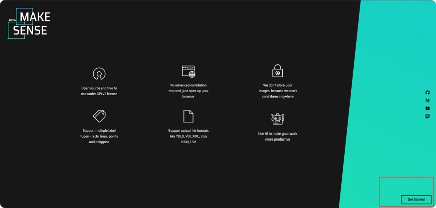
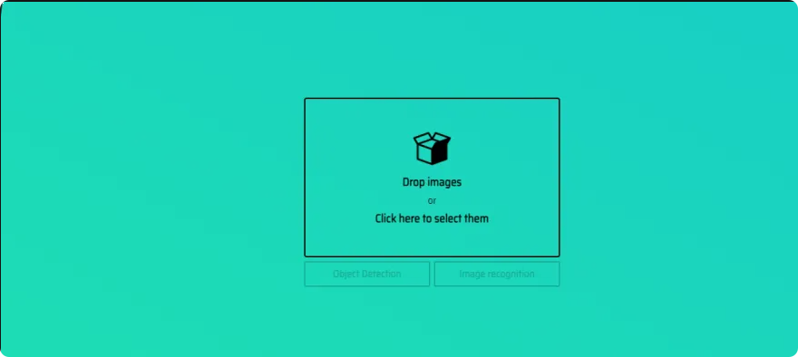
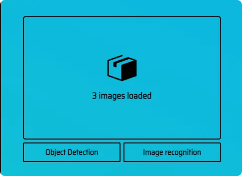
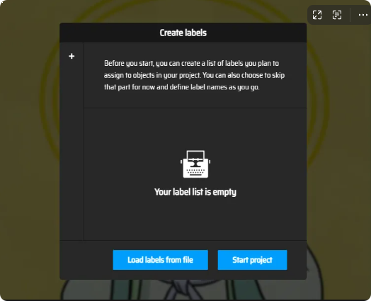
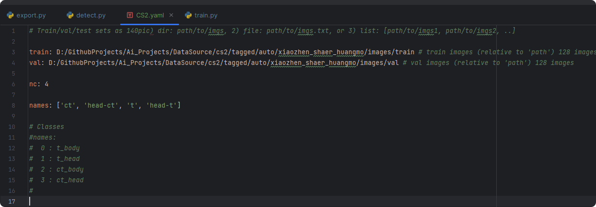
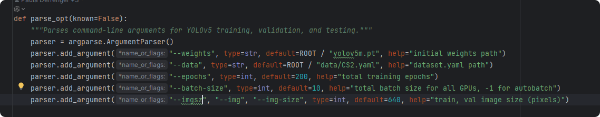
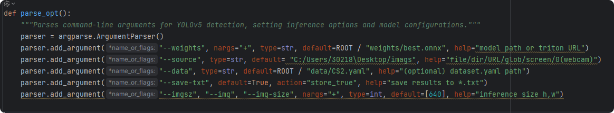
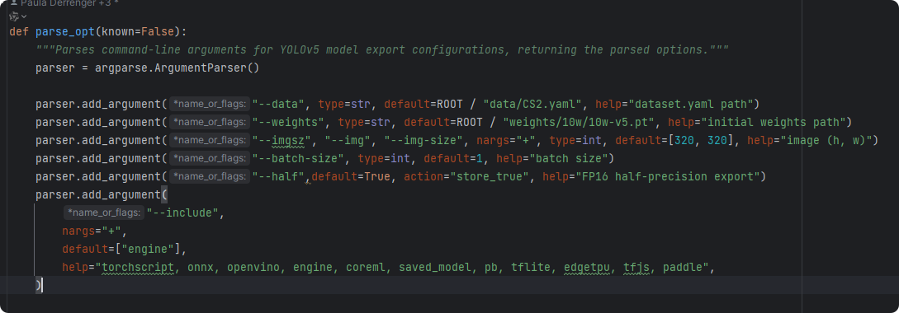

# YOLOV5 QUICK START 🚀

1. [Image labeling tool](##Image labeling tool)
2. [Training model](##Training model)
3. [Automatically Label Dataset](##Automatically Label Dataset)
4. [Model Conversion](##Model Conversion)
5. [PT Convert to ENGINE](##PT Convert to ENGINE) 

*** 

## Requirements
1. Nvidia RTX 980 🆙, higher or equivalent 
2. And one of the following: 
   - Nvidia CUDA Toolkit 11.8 [DOWNLOAD HERE](https://developer.nvidia.com/cuda-11-8-0-download-archive)
   - OR other versions.

## Image labeling tool

Online labelling site: https://www.makesense.ai/

### 1. Introduction
The website makesense is a labeling tool recommended by YOLO official.

Compared to other tools, the difficulty of the tool is very low. In just a few minutes, players can master the functional options in the workbench, and quickly enter the working state.

### 2. Quick Start
#### 2.1 Select image datasets that require annotation.
1. Let's get into the website.
   

2. Drag the dataset into it.
   
3. Select Object Detection or Image Classification. Sometimes we select object detection.
   
4. Create a class.txt file to define the classes.
   ```
   ct
   head-ct
   t
   head-t
   ```
5. Drop the `class.txt` file into it.

   
6. Now you can label the object.


#### 2.2 Construction the dataset
```
dataset
|
|__images|
|        |
|	 |__train
|        |
|        |__val
|
|__labels
|        |
|        |__train
|        |
|        |__val
|
|__classes.txt
```

***

## Training model

### 1. Configuration file
Create a configuration file xx.yaml to set some configurations in the folder data.


| Parameter | Value |
|---|---|
| **train** | The path of the training images |
| **val** | The path of the validation images |
| **nc** | The number of classes |
| **names** | The names of classes |


### 2. Start to train
#### 2.1 Some Configurations
In the train.py file, you must modify some configurations as in the following picture.


| Parameter | Value |
|---|---|
| **weights** | The path of yolov5.pt |
| **data** | The path of the above file xx.yaml |
| **epochs** | The number of training |
| **batch-size** | The batch size of the train, the larger the better (occupying more graphics memory) |
| **imgsz** | The size of the captured image |

#### 2.2 Training Done
If you've done the above work, you can execute the train.py to start training.
   
The `xx.pt` file will be generated after the training is completed.


## Automatically Label Dataset

### 1. Some Configurations with detect.py


| Parameters | Description |
|------------|---|
| **Weights**    | Path to the trained PyTorch model file |
| **Source**     | Path to the images that need to be detected |
| **Data**       | Path to the xx.yaml file in the `data` folder |
| **save-txt**   | Whether to generate the label.txt file |
| **imgz**       | Size of the captured images |


### 2. Result
In the folder of run/detection/exp, you can find the result.


*** 

## Model Conversion

Some Configurations with **export.py**


Here's the information provided in a tabular format:

| Parameters             | Description                                                                                   |
|------------------------|-----------------------------------------------------------------------------------------------|
| **weights**                | The path of the trained PyTorch (.pt) file.                                                   |
| **data**                   | The path of the xx.yaml file located in the "data" folder.                                     |
| **save-txt**               | A flag indicating whether to generate a label.txt file.                                         |
| **imgz**                   | The size of the captured images.                                                               |
| **half**                   | A flag indicating whether to convert to float16 for improved computational efficiency, with a potential trade-off in recognition accuracy. |
| **Exporting Model Format** | Describes the option to set the format of the exported model.                                   |

If the above works are completed, let's get to export your model.


*** 

## PT Convert to ENGINE

### 1. Requirements
1. Install Cupy Run the following 
   ```BASH
   pip install cupy-cuda11x
   ```
2. CUDNN Installation 🧩 Click to install [CUDNN](https://developer.download.nvidia.cn/compute/cudnn/secure/8.9.6/local_installers/11.x/cudnn-windows-x86_64-8.9.6.50_cuda11-archive.zip?Xt36GD6r_xgVE5h0rqiDisQXaVj-jm94e6_7UmvNhjIc3-yjoAgsGHsVMJz5IqYiSlkiwnKfawvxA7cJtcK009YYZxV4Q8e0KsubG1e7_wZslvEtAQYdd52EhPCNdkCuweO4q3_rvjepCFBQJo8V3Cg5MEJxTtKTqGzI6VHAk6UAONqoAfM7IDiRdKcAHC_VuHSFORLB-fLuQWD8iyaxUQ==&t=eyJscyI6ImdzZW8iLCJsc2QiOiJodHRwczovL3d3dy5nb29nbGUuY29tLmhrLyJ9) 📥. You'll need a Nvidia account to proceed. Don't worry it's free
3. Unzip and Relocate 📁➡️ Open the .zip CuDNN file and move all the folders/files to where the CUDA Toolkit is on your machine, usually at `C:\Program Files\NVIDIA GPU Computing Toolkit\CUDA\v11.8`.
4. Get TensorRT 8.6 GA 🔽 Fetch [TensorRT 8.6 GA](https://developer.download.nvidia.cn/compute/machine-learning/tensorrt/secure/8.6.1/zip/TensorRT-8.6.1.6.Windows10.x86_64.cuda-11.8.zip?1aqzwQwK29pBLLySilm2lOqCtgk-sD7Y73rbbtEo5O-nxeL0zPwI4bLBGBRE061pclJ_BtBP7rb41ssvz-c1VKw3r1vdkIMVPWwXJTtoaZrlUC1DWjtxDkKI1FO2Rw8CMkGT2sM2RNa5da27OBqj2d9nbwtyVoM4hcC1vz48RjSGNUDjw59_P8utM_qd5aeQYPHLaVLKNWPcgioD50OF5Hg=&t=eyJscyI6ImdzZW8iLCJsc2QiOiJodHRwczovL3d3dy5nb29nbGUuY29tLmhrLyJ9) 🛒.
5. Unzip and Relocate 📁➡️ Open the .zip TensorRT file and move all the folders/files to where the CUDA Toolkit is on your machine, usually at `C:\Program Files\NVIDIA GPU Computing Toolkit\CUDA\v11.8`.
6. Python TensorRT Installation 🎡 Once you have all the files copied over, you should have a folder at `C:\Program Files\NVIDIA GPU Computing Toolkit\CUDA\v11.8\python`. If you do, good, then run the following command to install TensorRT in python.
   ```bash
   pip install "C:\Program Files\NVIDIA GPU Computing Toolkit\CUDA\v11.8\python\tensorrt-8.6.1-cp311-none-win_amd64.whl"
   ```
7. Set Your Environmental Variables 🌎 Add these paths to your environment:
   ```
   C:\Program Files\NVIDIA GPU Computing Toolkit\CUDA\v11.8\lib
   C:\Program Files\NVIDIA GPU Computing Toolkit\CUDA\v11.8\libnvvp
   C:\Program Files\NVIDIA GPU Computing Toolkit\CUDA\v11.8\bin
   ```
### 2. Run the Export Script

🏃‍♂️💻 Time to execute `export.py` with the following command. 

Patience is key; it might look frozen, but it's just concentrating hard! Can take up to 20 mintues.

```bash
python .\export.py --weights ./yolov5s.pt --include engine --half --imgsz 320 320 --device 0
```
Note: You can pick a different YOLOv5 model size. TensorRT's power allows for larger models if desired!

If you've followed these steps, you should be all set with TensorRT! ⚙️🚀


*** 


## Reference
1. https://blog.csdn.net/J_oshua/article/details/130017483
2. https://blog.csdn.net/To_ChaRiver/article/details/119619515?ops_request_misc=%257B%2522request%255Fid%2522%253A%2522171034220316800222823829%2522%252C%2522scm%2522%253A%252220140713.130102334..%2522%257D&request_id=171034220316800222823829&biz_id=0&utm_medium=distribute.pc_search_result.none-task-blog-2~all~top_click~default-1-119619515-null-null.142^v99^control&utm_term=make%20sense&spm=1018.2226.3001.4187